# 🎪 POP'N UP

<div align="center">

### 팝업스토어 탐색부터 예약 · 결제 · QR 체크인까지 한 번에

**흩어져 있는 팝업스토어 정보를 한곳에서 탐색하고,  
예약부터 결제, QR 체크인까지 하나의 흐름으로 연결하는 팝업스토어 통합 플랫폼**

<br>


</div>

---

## 📑 목차

- [프로젝트 소개](#-프로젝트-소개)
- [팀원 및 역할](#-팀원-및-역할)
- [주요 기능](#-주요-기능)
- [기술 스택](#-기술-스택)
- [서비스 플로우](#-서비스-플로우)
- [시스템 아키텍처](#-시스템-아키텍처)
- [ERD](#-erd)
- [기술적 의사결정](#-기술적-의사결정)
- [트러블 슈팅 & 성능 개선](#-트러블-슈팅--성능-개선)
- [테스트](#-테스트)
- [CI/CD & AWS](#️-cicd--aws)
- [모니터링](#-모니터링)
- [프로젝트 성과](#-프로젝트-성과)
- [프로젝트 구조](#-프로젝트-구조)
- [향후 개선](#-향후-개선)

---

## 📌 프로젝트 소개

### 프로젝트 배경

팝업스토어 정보는 SNS, 블로그, 포털 검색, 지도, 공식 홈페이지 등 여러 채널에 분산되어 있습니다.

이 때문에 사용자는 원하는 팝업스토어를 찾기 위해 여러 플랫폼을 직접 확인해야 하며, 관심 있는 팝업의 위치와 운영 기간, 예약 일정 등을 한눈에 비교하기 어렵습니다.

POP'N UP은 이러한 문제를 해결하기 위해 **팝업스토어 탐색 → 예약 → 결제 → QR 체크인** 과정을 하나의 서비스로 연결했습니다.

### 핵심 목표

- 팝업스토어 정보 통합 탐색
- 스케줄 기반 예약 및 정원 관리
- KakaoPay 기반 결제
- QR 기반 현장 체크인
- JWT / OAuth2 기반 인증·인가
- 동시 예약 상황에서의 데이터 정합성 보장
- 부하 테스트를 통한 병목 식별 및 성능 개선
- AWS 기반 운영 환경 및 CI/CD 구축

---

## 👥 팀원 및 역할

> 팀원별 담당 기능은 최종 담당 범위에 맞춰 작성합니다.

| 팀원 | 담당 기능 | 기술 고도화 |
| --- | --- | --- |
| 박지오 | 회원 / 인증 / 결제 / AWS 배포 | JWT Blacklist, 결제 동시성 검증, AWS CI/CD |
| 팀원 2 |  |  |
| 팀원 3 |  |  |

---

## ✨ 주요 기능

### 🔐 회원 / 인증

- 회원가입 및 로그인
- JWT 기반 인증
- Kakao OAuth2 로그인
- 회원 정보 조회
- 비밀번호 변경
- 회원 탈퇴
- USER / ADMIN 권한 관리
- Redis JWT Blacklist 기반 로그아웃 토큰 재사용 방지

### 🏪 팝업스토어

- 팝업스토어 등록 / 조회 / 수정 / 삭제
- 팝업 카테고리 및 운영 상태 관리
- 팝업 이미지 관리
- Naver Geocoding 기반 주소 좌표 변환
- 지도 영역 기반 팝업 조회
- 사용자 위치 기반 주변 팝업 조회
- 팝업 데이터 크롤링

### 📅 스케줄

- 팝업스토어별 예약 일정 생성
- 스케줄 일괄 등록
- 최대 정원 및 현재 예약 인원 관리
- 스케줄 조회

### 🎫 예약

- 스케줄 기반 예약 생성
- 예약 내역 조회
- 예약 취소
- 예약 상태 관리
- 동일 회원 중복 활성 예약 방지
- 동시 예약 정원 정합성 제어
- 결제 타임아웃 자동 처리
- 스케줄 종료 후 미방문 예약 처리

### 💳 결제

- KakaoPay Ready API 연동
- KakaoPay Approve API 연동
- Payment 도메인 기반 결제 정보 관리
- PaymentStatus 기반 상태 관리
- 동일 예약 중복 결제 방지
- 동시 결제 요청 정합성 검증

### 📱 QR 체크인

- ZXing 기반 QR 코드 생성
- 결제 완료 예약 QR 발급
- 예약번호 기반 현장 체크인
- 중복 QR 체크인 방지
- 동시 체크인 정합성 검증

### 🛡️ 관리자

- 관리자 전용 API
- 회원 목록 조회
- 회원 상태 관리
- 관리자 예약 목록 조회
- 팝업 / 날짜 / 예약 상태 기반 조건 검색

---

## 🛠 기술 스택

### Backend

<p>
  
  
  
  
  
</p>

### Database & Cache

<p>
  
  
  
</p>

### Authentication & External API

- Spring Security
- JWT
- Kakao OAuth2
- KakaoPay
- Naver Geocoding
- ZXing

### Test & Performance

- JUnit 5
- MockMvc
- Testcontainers
- k6
- Spring Boot Actuator

### Infra & CI/CD

<p>
  
  
  
</p>

---

## 🔄 서비스 플로우

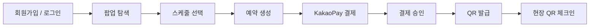

---

## 🏗 시스템 아키텍처

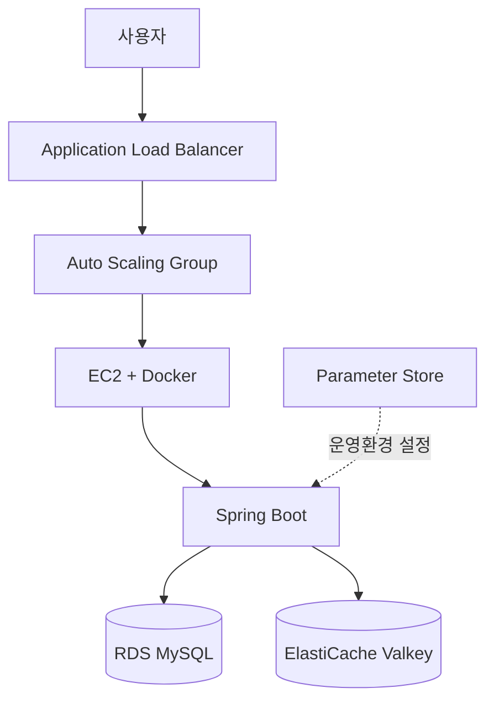

### AWS 네트워크 구성

- POP'N UP 전용 VPC
- Public / Private Subnet 구성
- NAT Gateway 구성
- Security Group 기반 접근 제어
- ALB → EC2
- EC2 → RDS MySQL
- EC2 → ElastiCache Valkey

---

## 🗂 ERD

> ERD 이미지 추가 예정

주요 도메인은 다음과 같이 구성했습니다.

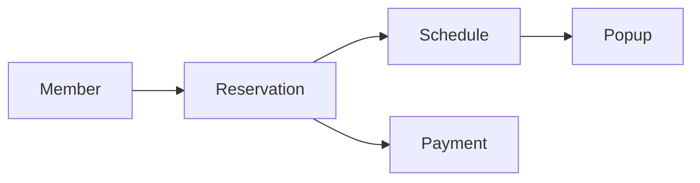

---

# 💡 기술적 의사결정

## 1. Layered Architecture

### 선택 이유

HTTP 요청 처리, 비즈니스 로직, 데이터 접근의 책임을 분리하기 위해 `Controller → Service → Repository` 기반 계층형 구조를 사용했습니다.

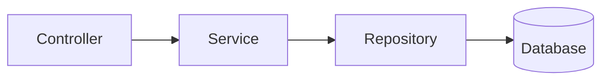

- **Controller**: HTTP 요청 및 응답 처리
- **Service**: 비즈니스 정책 및 트랜잭션 처리
- **Repository**: 데이터 접근

각 도메인을 중심으로 관련 Controller, Service, Repository, Entity, DTO를 분리하여 기능별 책임을 구분했습니다.

---

## 2. Spring Security + JWT

### 선택 이유

서버가 사용자별 세션을 관리하지 않는 Stateless 인증 구조를 구성하기 위해 JWT를 적용했습니다.

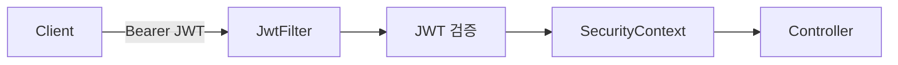

일반 사용자와 관리자는 `ROLE_USER`, `ROLE_ADMIN`으로 구분하여 API 접근 권한을 제어했습니다.

Kakao OAuth2 로그인 역시 로그인 성공 후 서비스 JWT를 발급하여 동일한 인증 체계를 사용하도록 구성했습니다.

---

## 3. Redis JWT Blacklist

### 문제

JWT는 Stateless 방식이므로 로그아웃 이후에도 토큰의 유효기간이 남아 있다면 기존 Access Token을 다시 사용할 수 있습니다.

### 적용

로그아웃된 JWT를 Redis Blacklist에 저장하고 인증 과정에서 Blacklist 등록 여부를 검사하도록 구성했습니다.

Blacklist 데이터는 JWT의 남은 유효시간을 기준으로 관리하여 만료 이후 자동으로 제거되도록 했습니다.

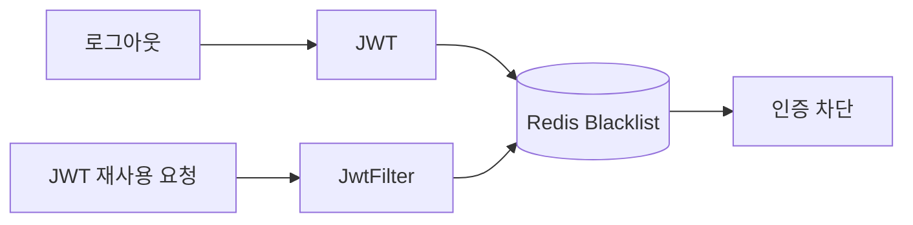

---

## 4. QueryDSL

### 선택 이유

관리자 예약 조회에서 팝업, 날짜, 예약 상태 등 여러 검색 조건을 동적으로 조합할 필요가 있었습니다.

QueryDSL의 `BooleanExpression`을 이용하여 필요한 조건만 동적으로 조합하고, Fetch Join을 이용하여 예약 조회에 필요한 연관 데이터를 함께 조회하도록 구성했습니다.

### 적용 영역

- 팝업 ID 조건
- 날짜 조건
- 예약 상태 조건
- Reservation / Member / Schedule / Popup 연관 조회

---

# 🚀 트러블 슈팅 & 성능 개선

## 1. 예약 동시성 개선

### Pessimistic Lock → Conditional UPDATE

#### 🔍 문제 원인

초기 예약 생성에서는 동일한 스케줄에 여러 요청이 동시에 들어와 정원을 초과하는 문제를 방지하기 위해 비관적 락을 적용했습니다.

```sql
SELECT ...
FROM schedule
WHERE id = ?
FOR UPDATE;
```

데이터 정합성은 보장할 수 있었지만 인기 스케줄에 동시 요청이 집중되면 Lock 획득을 위한 대기 행렬이 증가했습니다.

트랜잭션이 종료될 때까지 Lock을 보유하기 때문에 Lock 경합이 응답 지연과 처리량 저하로 이어졌습니다.

예약 취소 및 만료 과정에서도 Reservation과 Schedule Row에 비관적 락이 중첩되는 경합 지점이 존재했습니다.

#### 💡 개선

비관적 락 대신 **Conditional UPDATE**를 이용하여 정원 검증과 좌석 증가를 하나의 원자적인 쿼리로 처리하도록 변경했습니다.

```sql
UPDATE schedule
SET now_capacity = now_capacity + :count
WHERE id = :scheduleId
  AND now_capacity + :count <= max_capacity;
```

`affected rows = 1`이면 예약 성공, `0`이면 정원 초과로 판단하도록 구성했습니다.

예약 취소 및 만료 역시 상태와 현재 정원을 조건으로 검사하는 방식으로 변경했습니다.

---

### 🧪 테스트 시나리오

**정원 100명인 하나의 스케줄에 서로 다른 회원 4,000명이 동시에 예약을 요청하는 상황**을 구성했습니다.

| 항목 | 설정 |
| --- | --- |
| API | `POST /reservations` |
| 테스트 도구 | k6 |
| Executor | `per-vu-iterations` |
| VU | 4,000 |
| Iteration | 사용자당 1회 |
| 최대 정원 | 100명 |

### 📈 성능 비교

| 지표 | Pessimistic Lock | Conditional UPDATE | 변화 |
| --- | ---: | ---: | ---: |
| 표본 수 | 4,000 | 4,000 | - |
| 평균 응답시간 | 17,907.27ms | 11,866.10ms | **약 34% ↓** |
| 최대 응답시간 | 35,729.63ms | 16,188.80ms | **약 55% ↓** |
| 표준편차 | 7,134.14 | 3,563.71 | **약 50% ↓** |
| 처리량 | 102.56 req/s | 117.65 req/s | **약 15% ↑** |
| p95 | 28,063.10ms | 15,474.42ms | **약 45% ↓** |
| p99 | 28,974.27ms | 16,079.10ms | **약 45% ↓** |

### 🔒 데이터 정합성 검증

| 검증 항목 | Pessimistic Lock | Conditional UPDATE |
| --- | ---: | ---: |
| 성공 예약 | 100 / 100 | 100 / 100 |
| 정원 초과 | 0건 | 0건 |
| `now_capacity` 음수 | 0건 | 0건 |
| `now_capacity`와 실제 예약 합계 불일치 | 0건 | 0건 |
| 동일 회원 중복 활성 예약 | 0건 | 0건 |

### ✅ 결과

> **정합성 위반 0건을 유지하면서 평균 응답시간 약 34%, p99 약 45% 감소 및 처리량 약 15% 증가**

두 방식 모두 4,000명의 동시 요청에서 최대 정원 100명을 정확하게 유지했습니다.

Conditional UPDATE를 통해 데이터 정합성을 희생하지 않으면서 비관적 락의 경합 비용을 줄였습니다.

---

## 2. 과부하 구간 및 HikariCP 병목 분석

### 🔍 문제 원인

Conditional UPDATE 적용 이후에도 시스템이 실제로 어느 수준의 요청까지 안정적으로 처리할 수 있는지는 확인되지 않았습니다.

또한 기존 RateLimiter는 다음과 같이 설정되어 있어 실제 처리 한계보다 지나치게 높은 상태였습니다.

```yaml
limitForPeriod: 200000
limitRefreshPeriod: 1s
```

실제 부하 테스트에서 `429` 응답이 발생하지 않아 과부하 보호 역할을 수행하지 못하고 있음을 확인했습니다.

### 🧪 측정 방법

k6의 `ramping-arrival-rate`를 이용하여 예약 생성 요청을 **50 req/s → 1,000 req/s**까지 단계적으로 증가시켰습니다.

동시에 다음 지표를 관찰했습니다.

- HTTP 응답시간
- p99
- Dropped Iterations
- Docker CPU / Memory
- HikariCP Connection

### 📈 측정 결과

#### Container Resource

| Container | CPU | Memory |
| --- | ---: | ---: |
| Spring Boot | 53.99% | 8.62% |
| MySQL | 23.68% | 6.50% |

#### HikariCP

| 지표 | 값 |
| --- | ---: |
| `connections.max` | 50 |
| `connections.active` | **50 / 50** |
| Connection 사용률 | **100%** |

#### HTTP

| 지표 | 결과 |
| --- | ---: |
| 안정 처리량 | 약 **800 req/s** |
| 포화 시작 | 약 **800 ~ 900 req/s** |
| 평균 응답시간 | 약 776ms → 병목 진입 시 약 13초 |
| p99 | 약 **25.8초** |
| Dropped Iterations | 약 **70%** |

### 🔬 Connection Pool 추가 검증

CPU와 Memory는 병목 구간에서도 여유가 있었지만 HikariCP는 `50 / 50`으로 포화되었습니다.

Connection Pool과 포화 시점 사이의 관계를 추가로 확인하기 위해 `maximum-pool-size`를 변경하여 다시 측정했습니다.

| HikariCP Maximum Pool Size | 포화 시작 |
| ---: | ---: |
| 50 | 약 900 req/s |
| 20 | 약 290 req/s |

### ✅ 결과

> **해당 테스트 환경의 주요 병목이 CPU나 Memory가 아니라 DB Connection Pool임을 확인했습니다.**

Pool Size를 `50 → 20`으로 줄였을 때 포화 시점 역시 약 `900 → 290 req/s`로 앞당겨지는 것을 확인했습니다.

---

## 3. Redis 사전 필터링

> 🚧 **개선 설계 단계 — 적용 후 최종 성능 측정 필요**

### 🔍 문제 원인

Conditional UPDATE 방식에서도 정원이 이미 가득 찬 이후의 요청은 DB에 접근해야 정원 초과 여부를 확인할 수 있습니다.

따라서 **실패가 확실한 요청도 DB Connection을 점유**하면서 과부하 상황에서 Connection Pool 고갈을 가속할 수 있습니다.

### 💡 개선 설계

Redis 원자적 카운터를 DB 앞단의 1차 필터로 추가하여 예약 가능 여부를 먼저 확인하는 구조를 설계했습니다.

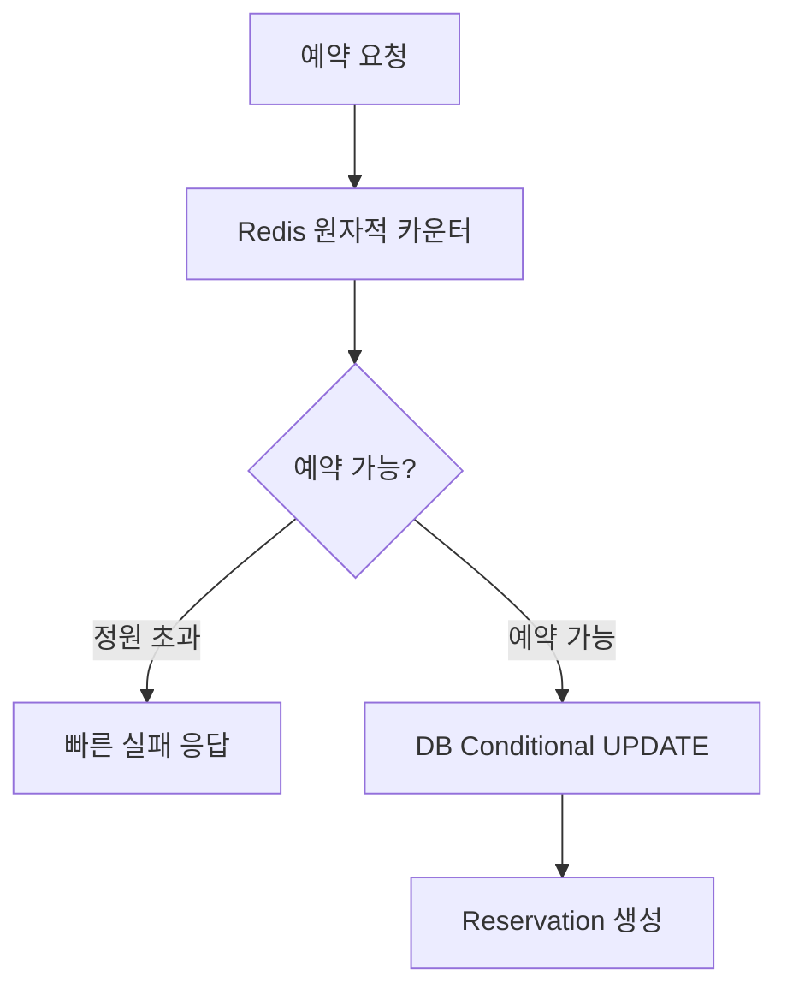

정원이 이미 가득 찬 요청을 DB 접근 전에 차단하여 불필요한 DB Connection 사용을 줄이는 것을 목표로 합니다.

> Redis 적용 이후 DB Connection 사용량, p95/p99, 처리량, Dropped Iterations에 대한 최종 성능 측정은 별도로 진행합니다.

---

## 4. 중복 결제 방지

### 🔍 문제 원인

동일 Reservation에 두 개의 결제 생성 요청이 동시에 발생하면 애플리케이션에서 Payment 존재 여부를 먼저 검사하더라도 두 요청이 동시에 검증을 통과할 가능성이 있습니다.

### 💡 개선

애플리케이션 사전 검증과 DB UNIQUE Constraint를 함께 사용했습니다.

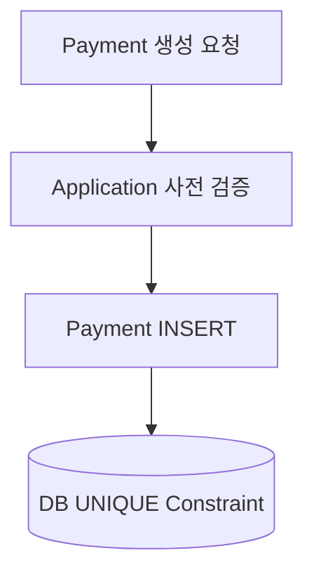

Reservation과 Payment 관계에서 `reservation_id`에 UNIQUE 제약을 적용하여 동일 예약에 여러 Payment가 생성되지 않도록 했습니다.

### 🧪 동시성 테스트

동일 Reservation에 대해 두 개의 독립적인 요청을 동시에 실행했습니다.

| 항목 | 결과 |
| --- | ---: |
| 동시 요청 | 2건 |
| 성공 | **1건** |
| 실패 | **1건** |
| 최종 Payment | **1건** |

### ✅ 결과

> **애플리케이션 사전 검증과 DB UNIQUE Constraint를 함께 적용하여 동시 요청에서도 하나의 Payment만 생성되는 것을 검증했습니다.**

---

## 5. 결제 승인 ↔ 예약 만료 Race Condition

### 🔍 문제 원인

결제 승인과 예약 만료가 거의 동시에 실행되면 두 로직이 동일한 Reservation 상태를 변경하려는 Race Condition이 발생할 수 있습니다.

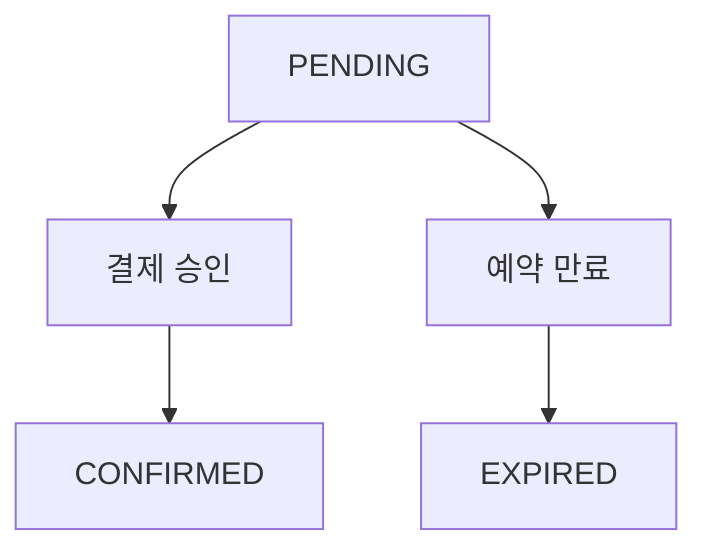

### 🧪 검증

결제 승인과 예약 만료를 독립적인 트랜잭션으로 동시에 실행하여 상태 경쟁 상황을 재현했습니다.

### ✅ 결과

만료 처리가 먼저 완료된 경우 Reservation은 `PENDING → EXPIRED`로 전이되며, 이후 결제 승인 요청은 실패하도록 처리했습니다.

좌석 역시 한 번만 복구되는 것을 확인했습니다.

> 이를 통해 **동시 실행을 직렬화하는 것과 올바른 비즈니스 상태를 결정하는 것은 별개의 문제**라는 점을 확인했습니다.

---

## 6. AWS 배포 후 Redis Health Check 장애

### 🔍 문제 상황

AWS 배포 이후 Spring Boot는 실행되었지만 Actuator Health Check가 다음과 같이 나타났습니다.

```json
{
  "status": "DOWN"
}
```

HTTP 응답 역시 `503` 상태였습니다.

### 🔎 원인

운영 환경에서 Redis Host가 `localhost:6379`를 바라보고 있어 Redis Health Check가 실패하고 있었습니다.

### 💡 해결

ElastiCache Valkey를 구성하고 Security Group과 Parameter Store의 `REDIS_HOST`, `application-prod.yaml`을 연결했습니다.

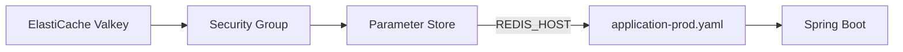

### ✅ 결과

```json
{
  "status": "UP"
}
```

Actuator Health Check가 정상화되었고 ALB Target 역시 **Healthy** 상태로 전환되었습니다.

이후 Instance Refresh 배포가 정상적으로 완료되는 것을 확인했습니다.

---

## 🧪 테스트

핵심 비즈니스 로직뿐 아니라 데이터 정합성이 중요한 예약과 결제 영역에는 별도의 동시성 테스트를 구성했습니다.

### 주요 테스트

| 영역 | 테스트 |
| --- | --- |
| Auth | `AuthServiceTest` |
| Member | `MemberControllerTest`, `MemberServiceTest` |
| Payment | `PaymentTest`, `PaymentRepositoryTest`, `KakaoPayProviderTest`, `KakaoPayProviderConcurrencyTest` |
| Reservation | `ReservationTest`, `ReservationControllerTest`, `ReservationServiceTest` |
| Reservation | `ReservationCancelManagerTest`, `ReservationTimeoutProcessorTest` |
| Concurrency | `ScheduleBookingConcurrencyTest` |
| Concurrency | `ReservationCancelConcurrencyTest` |
| Concurrency | `ReservationCheckInConcurrencyTest` |
| Schedule | `ScheduleTest`, `ScheduleControllerTest`, `ScheduleServiceTest` |
| QR | `QrServiceTest` |

### CI 테스트 자동화

Pull Request가 생성되면 GitHub Actions에서 자동으로 검증합니다.

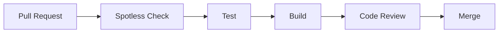

---

## ☁️ CI/CD & AWS

### AWS 구축 현황

| 영역 | 적용 내용 | 상태 |
| --- | --- | :---: |
| VPC | POP'N UP 전용 VPC | ✅ |
| Subnet | Public / Private Subnet | ✅ |
| NAT Gateway | Private EC2 외부 통신 | ✅ |
| Security Group | ALB → EC2 → RDS / Valkey 접근 제어 | ✅ |
| RDS | MySQL 운영 DB | ✅ |
| Parameter Store | 운영 DB / Redis 설정 관리 | ✅ |
| ECR | Docker Image Repository | ✅ |
| IAM / OIDC | GitHub Actions AWS 인증 | ✅ |
| Launch Template | EC2 실행 환경 관리 | ✅ |
| Auto Scaling Group | EC2 자동 관리 | ✅ |
| Target Group | EC2:8080 연결 | ✅ |
| ALB | 외부 요청 전달 | ✅ |
| Actuator | Health Check | ✅ |
| ElastiCache | Valkey 운영 Redis | ✅ |
| Instance Refresh | 새 Version 자동 교체 | ✅ |
| Auto Scaling Policy | 평균 CPU 30% Target Tracking | ✅ |
| Scale-Out | EC2 1 → 2 실검증 | ✅ |
| Scale-In | EC2 2 → 1 | 🔄 확인 중 |
| Route 53 | 도메인 연결 | ⏳ 미적용 |
| ACM | SSL 인증서 | ⏳ 미적용 |
| HTTPS | ALB 443 / Redirect | ⏳ 미적용 |

---

### CI/CD Pipeline

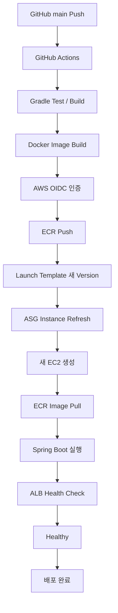

### 배포 방식

GitHub Actions에서 AWS Access Key를 장기간 저장하는 방식 대신 **OIDC 기반 IAM Role 인증**을 사용했습니다.

새로운 Docker Image가 ECR에 Push되면 새로운 Launch Template Version을 생성하고 Auto Scaling Group의 Instance Refresh를 통해 새로운 EC2로 교체하도록 구성했습니다.

---

### 📈 Auto Scaling 실검증

Target Tracking Policy의 평균 CPU 목표값을 **30%**로 설정했습니다.

실제 EC2에 CPU 부하를 발생시켜 Scale-Out을 검증했습니다.

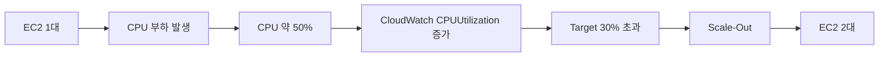

### ✅ 결과

> **실제 CPU 부하 발생 후 Auto Scaling Group의 EC2가 1대에서 2대로 증가하는 것을 확인했습니다.**

Scale-Out 설정을 구성하는 데 그치지 않고 실제 CloudWatch Metric과 Scaling Policy가 동작하는 것을 검증했습니다.

---

## 📊 모니터링

부하 테스트와 AWS 운영 검증 과정에서 다음 지표를 확인했습니다.

| 지표 | 활용 목적 |
| --- | --- |
| k6 avg / p95 / p99 | API 응답 지연 분석 |
| k6 Dropped Iterations | 시스템 처리 한계 확인 |
| HikariCP Active / Max | DB Connection Pool 포화 확인 |
| Docker CPU / Memory | Application / MySQL Resource 확인 |
| Actuator Health | Application 및 의존 서비스 상태 확인 |
| CloudWatch CPUUtilization | EC2 부하 및 Auto Scaling 판단 |
| ALB Target Health | Instance 정상 여부 확인 |

### 모니터링을 통해 확인한 내용

- CPU / Memory보다 DB Connection Pool이 먼저 포화되는 현상 확인
- HikariCP `50 / 50` 상태와 HTTP 응답 지연의 관계 확인
- CloudWatch CPUUtilization 증가에 따른 Auto Scaling 동작 확인
- Redis 연결 장애가 Actuator와 ALB Health Check에 미치는 영향 확인

---

## 📈 프로젝트 성과

| 핵심 지표 | 결과 |
| --- | ---: |
| 동시 예약 요청 | **4,000명** |
| 최대 정원 | **100명** |
| 정원 정합성 위반 | **0건** |
| 평균 응답시간 개선 | **약 34% ↓** |
| p99 개선 | **약 45% ↓** |
| 응답시간 표준편차 | **약 50% ↓** |
| 처리량 | **약 15% ↑** |
| 안정 처리량 측정 | **약 800 req/s** |
| HikariCP 병목 | **50 / 50 포화 확인** |
| 동시 결제 요청 | **2건 → Payment 1건 유지** |
| AWS Scale-Out | **EC2 1 → 2 실검증** |

---

## 📁 프로젝트 구조

```text
src/main/java/com/popnup
├── PopnupApplication.java
│
└── popnupbackend
    ├── domain
    │   ├── admin
    │   ├── auth
    │   ├── member
    │   ├── payment
    │   ├── popup
    │   ├── qrcode
    │   ├── reservation
    │   └── schedule
    │
    └── global
        ├── common
        ├── config
        ├── crawler
        ├── entity
        ├── error
        ├── health
        └── security

src/main/resources
├── application.yaml
├── application-local.yaml
├── application-prod.yaml
└── application-test.yaml

.github/workflows
├── ci.yml
├── cicd.yml
└── notification.yml

Dockerfile
docker-compose.yaml
build.gradle
api-test.http
```

---

## 🔜 향후 개선

현재 완료된 기능과 아직 검증이 필요한 항목을 구분하여 관리하고 있습니다.

### 성능

- [ ] Redis 사전 필터링 적용 후 성능 재측정
- [ ] Redis 적용 전/후 HikariCP Connection 비교
- [ ] Redis 적용 전/후 p95 / p99 비교
- [ ] 조회 성능 Before / After 정량 측정
- [ ] 조회 캐싱 대상 선정 및 TTL 정책 검증
- [ ] 캐시 적용 전/후 성능 비교

### 모니터링

- [ ] 구조화 로그 정책 보강
- [ ] 로그 레벨 정책 정의
- [ ] 장애 / 이상 상황 감지 체계 보강

### AWS

- [ ] Auto Scaling Scale-In `2 → 1` 최종 검증
- [ ] Route 53 도메인 연결
- [ ] ACM SSL 인증서 적용
- [ ] ALB HTTPS 443 적용
- [ ] HTTP → HTTPS Redirect

---

## 🤝 협업 방식

- GitHub Issue 기반 작업 관리
- Feature Branch 기반 개발
- Pull Request를 통한 Code Review
- Branch Protection 적용
- PR Template / Issue Template 사용
- GitHub Actions 기반 CI
- Slack / Discord Workflow 알림

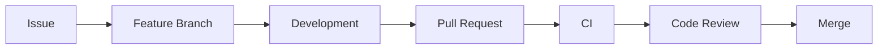

---

<div align="center">

### 🎪 POP'N UP

**Explore · Reserve · Pay · Check-in**

</div>